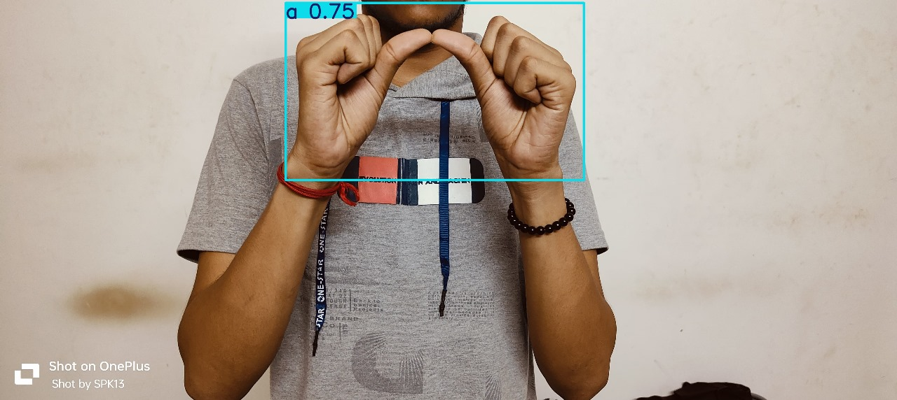
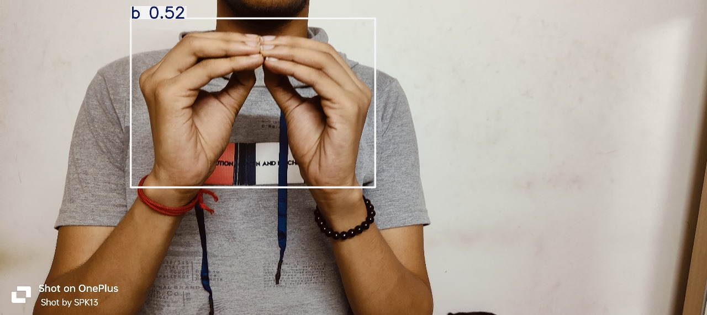

# Indian Sign Language Detection using YOLOv8

This project uses YOLOv8 for real-time detection of Indian Sign Language (ISL) alphabets. It includes a labeled dataset in YOLO format, ready for training, validation, and testing.

## Dataset Structure

This dataset is organized as follows:

```
isl_yolov8/
├── data.yaml                  # YOLO dataset configuration file
├── train/
│   ├── images/                # Training images
│   └── labels/                # Training labels
├── valid/
│   ├── images/                # Validation images
│   └── labels/                # Validation labels
├── test/
│   ├── images/                # Test images
│   └── labels/                # Test labels
```

## Features

- Supports real-time ISL alphabet detection
- Easily trainable with YOLOv8 (Ultralytics)
- YOLO-format annotations (.txt)
- Includes `data.yaml` for quick training

## Getting Started

### 1. Install YOLOv8 and dependencies

```bash
git clone https://github.com/ultralytics/ultralytics
cd ultralytics
pip install -e .
```

### 2. Train the Model

```bash
yolo task=detect mode=train model=yolov8n.pt data=path/to/data.yaml epochs=50 imgsz=640
```

Replace `path/to/data.yaml` with the path to your actual `data.yaml` file.

### 3. Validate the Model

```bash
yolo task=detect mode=val model=path/to/best.pt data=path/to/data.yaml
```

### 4. Run Inference

```bash
yolo task=detect mode=predict model=path/to/best.pt source=path/to/image_or_video
```

## Files Included

- `README.dataset.txt`: Info about the dataset structure
- `README.roboflow.txt`: Roboflow export metadata
- `data.yaml`: Label and path configuration for YOLOv8

## License

Check `README.roboflow.txt` and `README.dataset.txt` for licensing and generation details.

## Acknowledgements

- [Roboflow](https://roboflow.com/)
- [Ultralytics YOLOv8](https://github.com/ultralytics/ultralytics)

## Model Outputs





